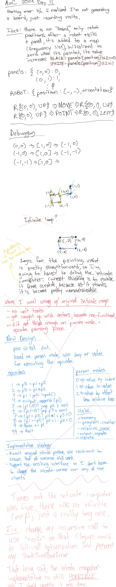

## AOC 2019 Day 11

## Prereqs

### Intcode Service
Run an instance of the intcode service from day 5 with `docker-compose up`

If you've added it to your hosts file, it should be exposed at http://intcode.docker.localhost, which is where the code assumes the service is deployed.

### Environment
Create `.env` file with:

```
session=<aoc session cookie from browser>
```

and place it into `aoc_2019_day_11`

### Dependencies

```bash
brew install leiningen
```

## Run

```bash
cd `aoc_2019_day_11`
lein run
```

## Notes
This one REALLY had me doubting my intcode computer, should have realized how slow it was and should have recognized earlier how to do tail-call optimization in Clojure.

